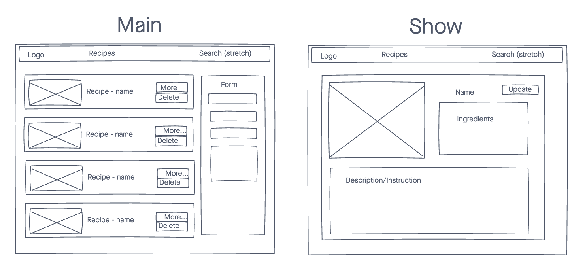
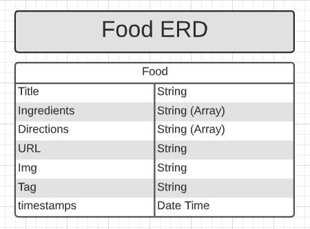

# Persian Recipe Food App

The Persian Recipe Food App is built with React and styled with Materialize and Material UI components.

This app displays a collection of recipes highlighting Iranian Cuisine on the Index page. Each dish is showcased in a Show page and has update and delete functionalit New recipes may be created and added to the list from a form located on the Index page. The About page details Iranian food history and culture in a toggle format.

## Technologies

- HTML
- CSS
- JavaScript
- Ruby(backend)
- Rails(backend)
- [React](https://reactjs.org/)
- [React-Router](https://reactrouter.com/)
- [Material-UI](https://material-ui.com/)
- [About images from Unsplash.com](https://unsplash.com/)

## Screenshots

### Wireframes

### ERD

### Images of App

## Getting Started

Click [here](website) to visit working App

## Future Enhancements

- Search functionality
- User model and user authentican
- Adding tags to recipes and for search and categorization
- Adding reviews/ratings
